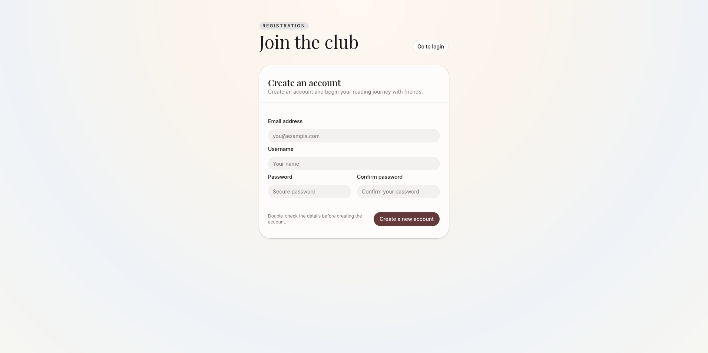

# User Guide
To be able to use the application easily and without confusion, here is a detailed user guide. You can use this guide to figure out how one specific feature works, or read this completely to gain full understanding of the application.

## Login Page

When opening the app for the first time, the user can see a login page with two fields: Username and Passowrd. By logging in with a pre-registered credentials, user can access the home page and all the application's functionality. On the login page user can see a button on top of the login form, called go to registration. From there the user can access registration form. 

## Registration Page

On the registration page the user can see a form. By filling out the form, the user can create an account. Pressing create new account button user is redirected to the login page, but only if the user has been registered successfully. In case the registration does not work, user is notified of that with an error.
 
 

## Home Page

## Book Club Page

## Books Page

In addition to adding books straight to the ongoing suggestion phase, users can save books for the future. This makes it easier fo users to keep track of their books, and makes it possible to suggest the same book in multiple clubs without having to write its information many times.

## Create Book Club Page

## Settings Page

