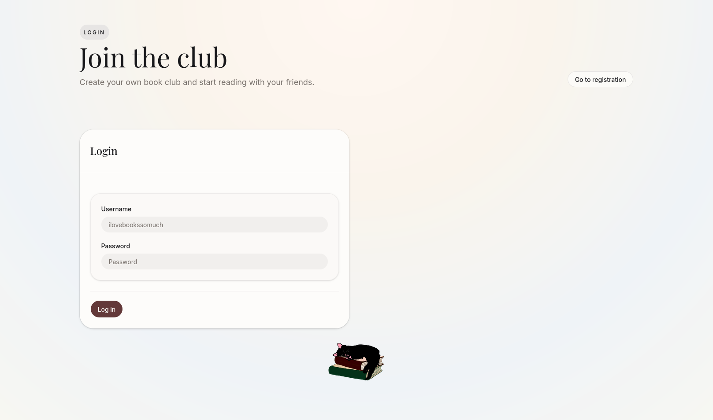
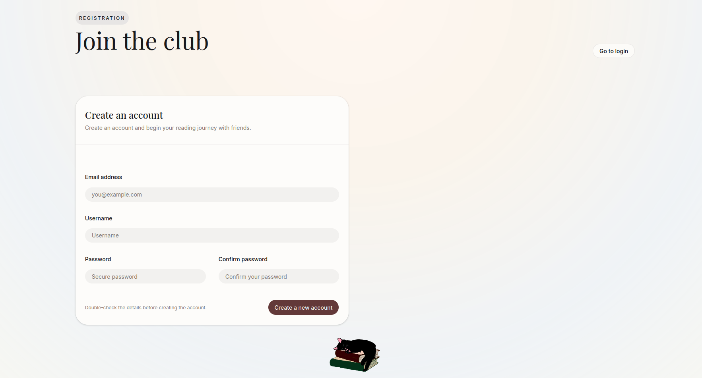
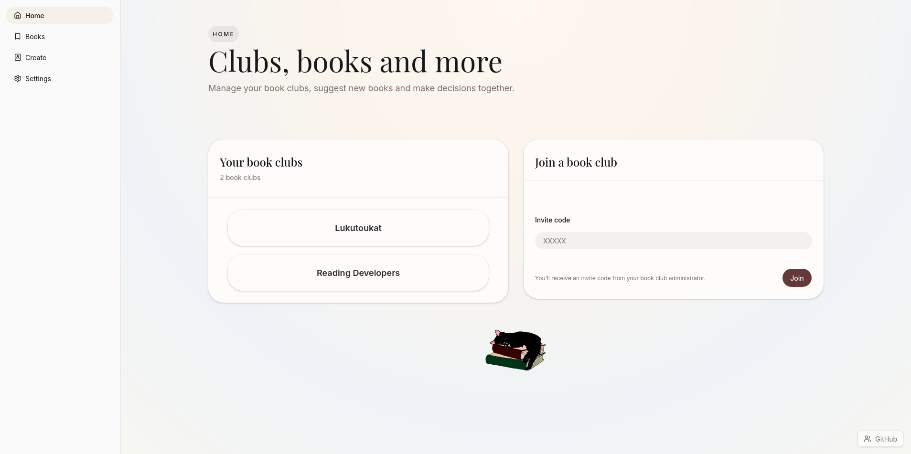
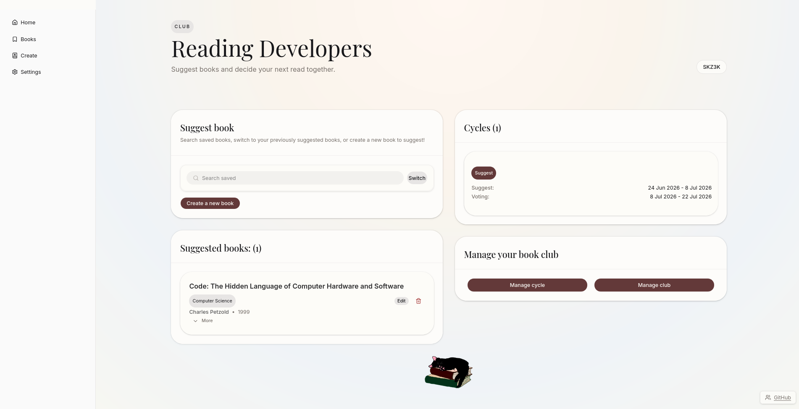
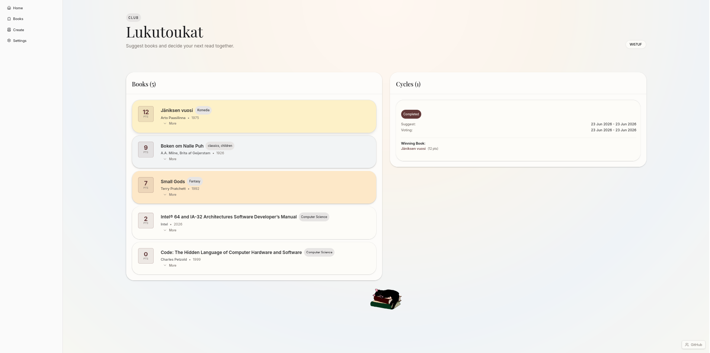
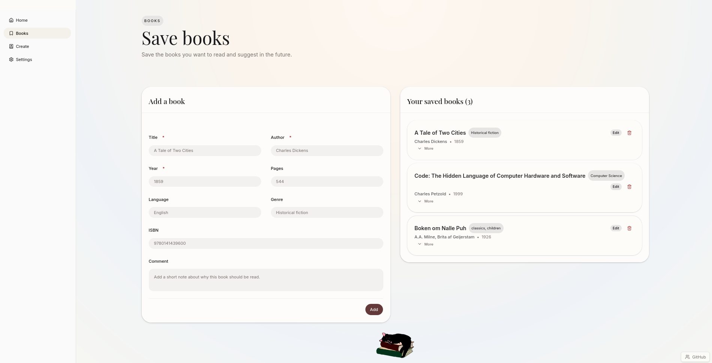
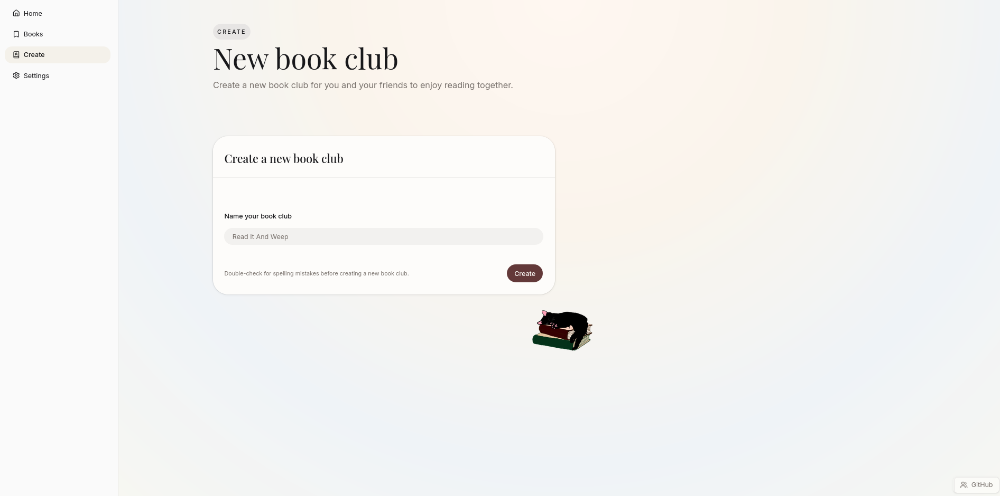
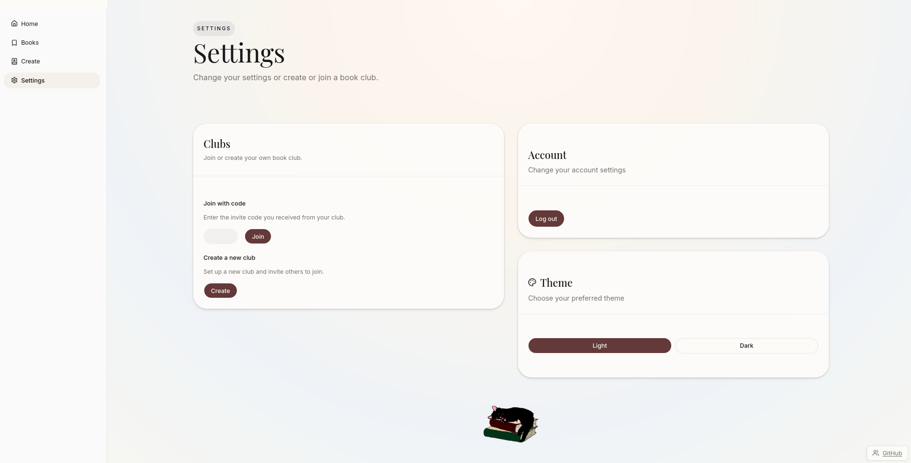

# User Guide
To be able to use the application easily and without confusion, here is a detailed user guide. You can use this guide to figure out how one specific feature works, or read this completely to gain full understanding of the application.

## Login Page

When opening the app for the first time, the user can see a login page with two fields: Username and Password. By logging in with a pre-registered credentials, user can access the home page and all the application's functionality. On the login page user can see a button on top of the login form, called go to registration. From there the user can access registration form. 

## Registration Page

On the registration page the user can see a form. The form contains the following fields: Email address, username, password and confirm password. Both emain and username must be unique. Password has to be written twice to encourage users to remember their credentials and making it possible to make sure there are no spelling mistakes. By filling out the form, the user can create an account. Pressing create new account button user is redirected to the login page, but only if the user has been registered successfully. In case the registration does not work, user is notified of that with an error.
 
 

## Home Page
On the home page the user can see all the clubs they have joined. In case the user is not a part of any club they won't see any clubs. In that case the user can fill out a join field at the bottom of the page with an invite code, and join a premade club. This invite code has been shared (hopefully) by the admin of the club. In case you have not recieved an invitation, contact the other book club memebers. 
 
Side/bottom bar is visible on either the left side of your screen or on the bottom, depending on your device's width. From there it is possible to move between pages. User can access home page, saved books page, club creation page and settings. 

## Book Club Page

After the user has joined a club successfully, they will automatically be directed to their club's page. If the user has joined the club before, they can go to their club's page through the club button ( has the club's name as a text ) that is visible on the home screen. On the club page the user can see different things depending on the current phase of the club and their role. 
 
At the top of the page, members of the club can see the invite code. The invite code can be copied to clipboard by clicking it.
 
If there are previous cycles, members of the club can see cycle history. Cycle history contains the status, the dates for the suggesting and voting phases and the winning book of each cycle.
 
Admin can see a manage your book club area, where they can manage the club's cycles and settings. From the settings page admins can delete their club. From the manage cycle page the user can see a calendar. On the calendar the user can choose two dates: first one for the end of the suggestion phase and the latter one for the end of the voting phase. By pressing create, the user creates the cycle, and is directed to the club's page. 
 
When the club's suggestion phase is active, members of the club can suggest one book they would like to read next. They can suggest their saved books (guide below), suggest new ones, or resuggest a book they suggested in the previous cycle. Suggesting a new book is done by pressing create book, user can fillout a form and add all relevant information related to the book.
 

 
After the suggestion phase ends, members can see a voting phase. Here they can vote books. Want to read gives 3 points, could read 2 points and won't read 0 points. The votes save automatically and can be changed during the voting phase. Not voting will give 0 points. Admins can end the ongoing phases at any point. New cycle will not start automatically. The result page will be shown until a new cycle is started.

## Books Page

In addition to adding books straight to the ongoing suggestion phase, users can save books for the future. This makes it easier for users to keep track of their books, and makes it possible to suggest the same book in multiple clubs without having to write its information many times. Books page includes a form for adding a book and a list of the books you have saved. The required fields for an added book are title, author and year. User can edit and remove their saved books. They can toggle the visibility of information about the book from more/less. 

## Create Book Club Page

The create book club page is fairly simple. It has a short input field where user can give the name of the book club they want to make. Upon pressing the create button, user will be directed to their club's page, where they can manage their club. 

## Settings Page

The settings page has three components: clubs, account and theme. From the clubs component user can either join an existing book club with the invite code or access the create book club page. From the account component user can log out. From the theme component user can switch between light and dark theme.
